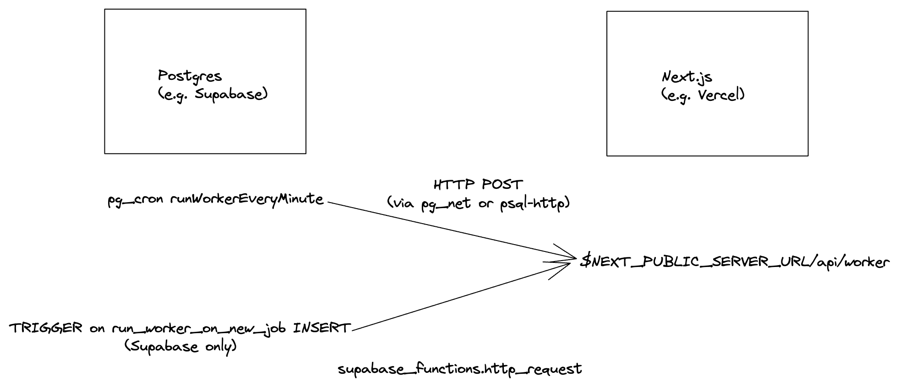

## WIP
- Introduce stream abstraction
  - meta only mode for sync
- Importing existing connections
- Complete stream abstraction
  - API only stateless mode mode
  - stream specific sync

## 2022-10-29 Background sync

Venice will now automatically sync in the background in addition addition to listening for webhook.

This is particularly useful for situations where webhooks aren't always available (e.g. sync current portfolio value due to price updating) or if your server was offline / encountered a problem during webhook handling

By default we will look for all connections that have not been sync'ed in the last 24 hours.

### Upgrade requirements

- Add a `WORKER_INVOCATION_SECRET` env var for security
- Ensure your postgres instance supports the following two extensions
  - [pg_cron](https://github.com/citusdata/pg_cron)
  - [pg_net](https://github.com/supabase/pg_net/) or [pgsql-http](https://github.com/pramsey/pgsql-http)
- Make sure your `NEXT_PUBLIC_SERVER_URL` is set correctly if not already

### Implementation detail

The main design goal is to keep the infrastructure lean and use the existing tooling as much as possible. Therefore we kept the job queue in postgres via [graphile-worker](https://github.com/graphile/worker/)

- `graphile-worker`'s main `run` function is implemented a next.js api route `/api/worker`, each run can execute multiple jobs
  - This means that the actual the actual work performed by the tasks are happening inside HTTP requests.
  - This design should scale really well because you only have to scale the HTTP server (which is stateless and automatic on Vercel)
- All business logic lives inside `graphile-worker` tasks. Notably graphile-worker has its own implementation of cron, which contains two tasks (recurring task `scheduleTasks` and `syncPipeline`)
  - Recurring tasks (aka cron) in `graphile-worker` is not to be confused with `pg_cron` and serves a separate purpose. `graphile-worker` is a node program and cannot run indefinitely in serverless environments, therefore `pg_cron` is needed to trigger the worker event loop.
- `pg_cron` has only a single schedule called `runWorkerEveryMinute`, and does a HTTP POST to `$NEXT_PUBLIC_SERVER_URL/api/worker` to trigger the worker
  - This means that jobs will normally get run once per minute
  - If you are using Supabase, then we added an optimization in the form of a [database webhook](https://supabase.com/blog/supabase-functions-updates#database-webhooks-alpha) that will trigger `/api/worker` anytime new job gets added. This means jobs should run with sub-second latency on supabase.
- `graphile-worker` normally deletes jobs, we archive them into `graphile_worker.jobs_completed` table for logging / analytics
- Migrates are required and they are run as part of the `build:worker` command in `apps/web`. This should be automatic if you use `Vercel`

[**Architecture diagram**](https://excalidraw.com/#json=ieN-yfQae4hZxIIyD0qrI,tiCIzHkByX9Z6ZszHLDKnw)

### Limitations

- If you are using vercel, then sync tasks may not take more than 10 seconds on hobby plan or 60 seconds on team plan, otherwise the function execution will time out.
