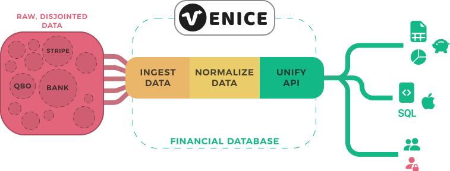

<Tip>Learn about all the ways people use Venice to give themselves superpowers in our [Use Cases](/use-cases).</Tip>

<Card title="Financial data, fast" icon="money-bill-transfer">
  Easily connect to thousands of financial institutions to automatically or manually sync data into Venice.
</Card>

Regardless of where your financial data lives, Venice can help you access it,
unify it, standardize it, and pipe it to where you need it most.

We currently work with Plaid, but are building integrations with Stripe, Quickbooks,
Yodlee, and many others... so you don't have to!

Save yourself the copy/paste woes, and trust your data again.

<Card title="Pipelines" icon="bars-staggered">
  Your data, your way. Send financial data from A to B, fast.
</Card>



**Finance teams:** We get it, you love AND hate your spreadsheets. We're here to 
offload the parts you hate onto Venice. Let us keep your data continuously synced
and accurate, and save yourself hours of manual updates.

**Developers & data analysts:** Treat Venice as your unified database, piping 
data in & normalizing it into a unified API. Don't worry about creating schema connectors,
or cron jobs, or hosting infrastructure, or security. Let us be the backend so 
you can build the future faster; your customers will thank you.

<Card title="Access data from Google Sheets or via CSV" icon="file-csv">
  Say goodbye to manual copy/paste errors and never lose sleep over keeping 
  spreadsheets up-to-date again.
</Card>

Venice comes with CSV exporting out-of-the-box for any queries you generate.
Need to filter transactions by vendor? Done! Need to see overall account balance
or burn rate? Easily create a separate query and export the data on a continuous 
basis.

There is a little known feature in Google Sheets that will change the way you 
work with your financial data: the [IMPORTDATA](https://support.google.com/docs/answer/3093335?hl=en&ref_topic=9199554)
function. Easily & automatically export your unified financial data from Venice 
and back into your spreadsheets for whichever queries you can dream up.

Here's how it works:

1. Connect all your various accounts across different financial institutions 
& let Venice do the hard work of standardizing & unifying the data.
2. Go into Google Sheets and copy/paste the CSV export link from within your
Venice dashboard:

```excel-formula Google Sheets (spreadsheet formula)
=IMPORTDATA("venice.is/api/sql?format=csv&q=SELECT data, amount FROM transaction")
```

3. Say goodbye to the headache of manually inputting financial data into 
spreadsheets, and hello to real-time, accurate financial data at your fingertips.

With Venice, your data is always up-to-date and you'll drastically reduce 
common & costly copy/paste errors. There's a better way, and Venice is it.

<Card title="Headless database" icon="database">
  Forget HTTP requests across tons of data sources. The best API is 
  a unified, standardized database.
</Card>

We build the backend, you build:

- the next Mint.com in a weekend
- dashboards & charts
- frontend apps
- internal tools
- no code apps (Bubble, Glide, Retool)
- custom scripts
- a million other things that move the needle for your business & customers

Don't lose sleep over the complexities of data engineering and scaleable
infrastructure. Focus on what really matters.

<Card title="Simply powerful" icon="magnifying-glass-dollar">
  The world is already built on SQL, now your financial data is too.
</Card>

SQL is one of the world's most powerful and commonly used languages to wrangle
data on a daily basis (2nd only to Excel formulas). Rather than force you to
learn yet another new way of doing things, Venice believes you should be able 
to access your data however you want.

Don't let the API stop you, with Venice you can generate powerful queries for all 
your data needs and use cases.

Everything is ready in your unified database.

```sql
select * from transactions
```